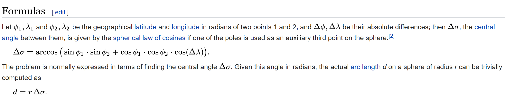

# Designing-an-UBER
## Objective
1.	Design a similar UBER application using the GPS co-ordinates of a person who needs a cab. 
2.	Developed a code using the Central Angle Formula to find the nearest cab to the customer which is stored in a JSON encoded input file.

## Approaching the Problem
* Using the JSON input file,use the Latitudes and Longitudes to get the location of the Available Cars
- To computer encoded language format, convert the string format of the Latitudes and Longitudes into Double
+ Now convert the degrees to radians as degrees cannot be readed by the Computer Language
- To calculate the distance between the Customer and the Cab use the Great Circle Distance Formula
+ If the distance between the car and the customer is less than 5 km then the output will display the nearest Cab driver name and user_id

